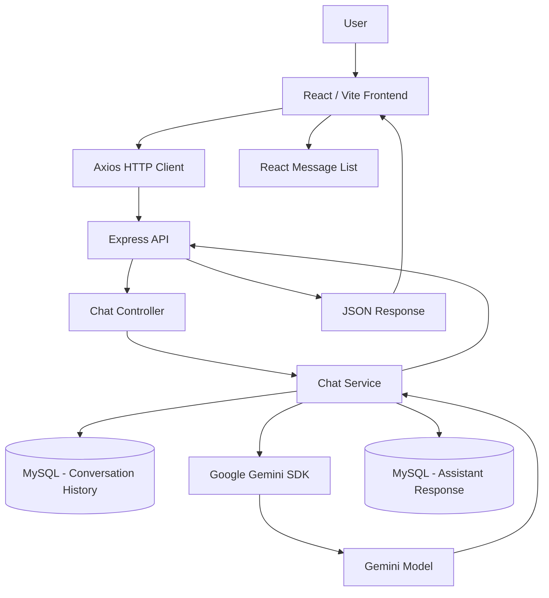

# GPT-Clone

A full-stack, ChatGPT-style conversational application built as part of an AI-powered application architecture course. GPT-Clone pairs a React/Vite chat interface with an Express backend that persists conversation history in MySQL and generates assistant responses using the Google Gemini API.


---

## Table of Contents

- [Overview](#overview)
- [Architecture](#architecture)
- [Key Features](#key-features)
- [Current Scope & Known Limitations](#current-scope--known-limitations)
- [Project Structure](#project-structure)
- [Getting Started](#getting-started)
- [Environment Configuration](#environment-configuration)
- [API Documentation](#api-documentation)
- [Database Schema](#database-schema)
- [Gemini Integration](#gemini-integration)
- [Troubleshooting](#troubleshooting)
- [Future Improvements](#future-improvements)
- [License](#license)

---

## Overview

GPT-Clone is composed of two independent applications that run side by side during development:

```
GPT-Clone/
├── Backend/    → Express API, MySQL persistence, Gemini integration
└── frontend/   → React/Vite single-page chat interface
```

The frontend sends user questions to the backend over HTTP, the backend persists messages in MySQL and forwards the conversation to Gemini, and the assistant's reply is stored and returned to the client for rendering.

## Architecture



**Responsibilities**

| Layer | Responsibility |
|---|---|
| React/Vite frontend | Presentation, input handling, optimistic UI, API requests, Markdown/code rendering |
| Express routes | HTTP endpoint registration |
| Controllers | Request parsing and response formatting |
| Services | Validation, conversation history retrieval, Gemini calls, persistence |
| MySQL | Durable conversation storage |
| Gemini SDK | Assistant response generation |
| Error middleware | Centralized error responses |

## Key Features

- ChatGPT-style conversational interface
- Persistent user and assistant messages in MySQL
- Gemini-powered assistant responses
- Recent conversation history sent to Gemini for context
- Optimistic user-message rendering while a response is generated
- Loading indicator while Gemini is responding
- Markdown rendering for assistant responses
- Syntax-highlighted code blocks
- Automatic scrolling to the latest message
- Centralized backend error handling
- Modular Express MVC backend organization
- Separate frontend and backend applications

## Current Scope & Known Limitations

This project is a functional full-stack learning application with a production-oriented architecture. It is **not** a production-hardened system. Notably:

- No authentication or user accounts are implemented.
- Conversations are stored in a single shared `conversations` table (no per-user or per-session separation).
- The frontend API base URL is currently hard-coded rather than environment-driven.
- Sidebar navigation items (Search chats, Images, Apps, Deep research, Codex, Projects) are presentational placeholders with no backing functionality.
- Responses are **not** streamed — the client waits for the complete Gemini response before rendering it.
- No production deployment configuration is included.
- No automated test suite is currently documented in the repository.

## Project Structure

```
GPT-Clone/
├── Backend/
│   ├── index.js
│   ├── package.json
│   ├── db/
│   │   ├── db.config.js
│   │   └── schema.sql
│   └── src/
│       ├── api/
│       │   ├── main.routes.js
│       │   └── chat/
│       │       ├── chat.routes.js
│       │       ├── controller/
│       │       │   └── chat.controller.js
│       │       └── service/
│       │           └── chat.service.js
│       └── middleware/
│           └── error-handler.js
├── frontend/
│   ├── package.json
│   ├── vite.config.js
│   └── src/
│       ├── App.jsx
│       ├── main.jsx
│       ├── index.css
│       └── components/
│           ├── ChatHeader/
│           ├── ChatInput/
│           ├── ChatMessage/
│           ├── MessageList/
│           └── Sidebar/
└── README.md
```

## Getting Started

### Prerequisites

- Node.js (with npm)
- A running MySQL server
- A Google Gemini API key

Both the backend and frontend have independent `package.json` files, so dependencies must be installed separately for each. Both servers must be running simultaneously for the application to work.

### 1. Clone the repository

```bash
git clone <repository-url>
cd GPT-Clone
```

### 2. Set up the database

Create the database:

```sql
CREATE DATABASE gpt_clone;
```

Select it and execute the schema:

```bash
mysql -u your_mysql_user -p gpt_clone < Backend/db/schema.sql
```

Then configure your database credentials in `Backend/.env` (see [Environment Configuration](#environment-configuration)).

### 3. Start the backend

```bash
cd Backend
npm install
node index.js
```

> `Backend/package.json` does not currently define `dev` or `start` scripts, so the server is started directly with `node index.js`. The backend checks that the MySQL connection succeeds before calling `app.listen`, so verify your database configuration first if the process exits early.

The backend runs at:

```
http://localhost:3000
```

### 4. Start the frontend

In a separate terminal:

```bash
cd frontend
npm install
npm run dev
```

The Vite development server runs at:

```
http://localhost:5173
```

Available frontend scripts:

```bash
npm run dev       # start the Vite dev server
npm run build      # production build
npm run preview     # preview the production build
npm run lint       # run ESLint
```

## Environment Configuration

Create a `.env` file inside `Backend/`:

```env
DB_HOST=localhost
DB_USER=your_mysql_user
DB_PASSWORD=your_mysql_password
DB_DATABASE=gpt_clone
GEMINI_API_KEY=your_gemini_api_key
GEMINI_MODEL=gemini-3.5-flash-lite
```

| Variable | Required | Notes |
|---|---|---|
| `DB_HOST` | No | Defaults to `localhost` if not set |
| `DB_USER` | Yes | Must match your local MySQL setup |
| `DB_PASSWORD` | Yes | Must match your local MySQL setup |
| `DB_DATABASE` | Yes | Must match your local MySQL setup |
| `GEMINI_API_KEY` | Yes | Required for all Gemini requests |
| `GEMINI_MODEL` | No | Defaults to `gemini-3.5-flash-lite` if not set |

The frontend does **not** read its API URL from an environment variable. It currently uses the hard-coded base URL `http://localhost:3000/api`, defined in `frontend/src/App.jsx`.

**Never commit `.env` files or API keys.** `Backend/.gitignore` already ignores `.env` and `node_modules`.

## API Documentation

All routes are mounted under `/api` via `Backend/src/api/main.routes.js`, which routes chat requests to `Backend/src/api/chat/chat.routes.js` under `/api/chat`.

### `GET /api/chat/conversations`

Fetches recent conversation rows. The controller requests up to 100 rows; the underlying service defaults to a limit of 5 but is called with 100 in the current implementation. Rows are queried in descending ID order and reversed before being returned, so the response is in chronological display order.

**Response — `200 OK`**

```json
{
  "success": true,
  "message": "conversations fetched successfully",
  "data": [
    {
      "id": 1,
      "role": "user",
      "content": "Hello",
      "created_at": "..."
    }
  ]
}
```

### `POST /api/chat/conversations`

Accepts a user question, validates it, persists it, sends it to Gemini along with recent history, and persists and returns the assistant's reply.

**Request body**

```json
{
  "question": "Explain how REST APIs work"
}
```

**Behavior**

1. Validates that `question` is not empty or whitespace-only.
2. Loads the five most recent conversation rows as Gemini chat history.
3. Inserts the user message into MySQL.
4. Creates a Gemini chat session using the configured model.
5. Sends the question to Gemini.
6. Stores the assistant's response and its token count in MySQL.
7. Returns both database-backed conversation rows.

**Response — `201 Created`**

```json
{
  "success": true,
  "message": "conversation posted successfully",
  "data": {
    "userConversation": {
      "id": 1,
      "role": "user",
      "content": "Explain how REST APIs work",
      "tokenCount": 0,
      "createdAt": "..."
    },
    "assistantConversation": {
      "id": 2,
      "role": "assistant",
      "content": "...",
      "tokenCount": 123,
      "createdAt": "..."
    }
  }
}
```

**Validation error — `400 Bad Request`**

An empty or whitespace-only `question` returns:

```json
{
  "status": false,
  "message": "Question is required"
}
```

All other errors are handled by the centralized Express error middleware and follow the same `{ "status": false, "message": "..." }` shape.

## Database Schema

Defined in `Backend/db/schema.sql`:

```sql
CREATE TABLE IF NOT EXISTS conversations (
    id BIGINT UNSIGNED AUTO_INCREMENT PRIMARY KEY,
    role ENUM('user', 'assistant') NOT NULL,
    content TEXT NOT NULL,
    token_count INT UNSIGNED NOT NULL DEFAULT 0,
    created_at TIMESTAMP NOT NULL DEFAULT CURRENT_TIMESTAMP
);
```

| Column | Description |
|---|---|
| `id` | Auto-incrementing conversation row identifier |
| `role` | Either `user` or `assistant` |
| `content` | The message text |
| `token_count` | Token count associated with the response; user messages default to `0` |
| `created_at` | Automatically generated timestamp |

The connection pool is configured in `Backend/db/db.config.js` using the `mysql2/promise` API and the `DB_HOST`, `DB_USER`, `DB_PASSWORD`, and `DB_DATABASE` environment variables.

## Gemini Integration

The backend uses the official Google Gemini SDK:

```js
import { GoogleGenAI } from '@google/genai';

const ai = new GoogleGenAI({
  apiKey: process.env.GEMINI_API_KEY
});
```

The model is configurable via environment variable with a fallback default:

```js
const GEMINI_MODEL = process.env.GEMINI_MODEL || "gemini-3.5-flash-lite";
```

Each chat request:

- Uses the configured `GEMINI_MODEL`.
- Sets `maxOutputTokens: 1024`.
- Converts recent MySQL conversation rows into Gemini chat history, mapping the database role `assistant` to the Gemini role `model` and the database role `user` to the Gemini role `user`.
- Sends the question through a **non-streaming** call: `chat.sendMessage({ message: question })`.
- Reads the assistant's token usage from `result.usageMetadata.totalTokenCount`.

## Troubleshooting

**MySQL connection failures**
Confirm MySQL is running and that `DB_HOST`, `DB_USER`, `DB_PASSWORD`, and `DB_DATABASE` in `Backend/.env` match your local setup. The backend verifies the database connection before calling `app.listen`, so a failed connection will prevent the server from starting.

**Missing `GEMINI_API_KEY`**
Requests to `POST /api/chat/conversations` will fail without a valid `GEMINI_API_KEY` in `Backend/.env`. Confirm the key is set and that the `.env` file is located inside `Backend/`.

**CORS or frontend/backend port mismatches**
The backend enables CORS specifically for `http://localhost:5173`. If the frontend is served from a different origin or port, requests will be blocked by the browser. Confirm the Vite dev server is running on its default port.

**Backend not running before frontend requests**
The frontend calls the hard-coded base URL `http://localhost:3000/api`. If the backend isn't running yet, requests will fail. Start the backend first, confirm it connects to MySQL successfully, then start the frontend.

## Future Improvements

The following are potential directions for future work and are **not** implemented in the current codebase:

- User authentication and per-user conversation isolation
- Streaming assistant responses
- Environment-driven frontend API configuration
- Functional implementations of sidebar navigation items
- Automated test coverage
- Deployment and CI/CD configuration

## License

No license is currently specified. Add a license before distributing this project.
